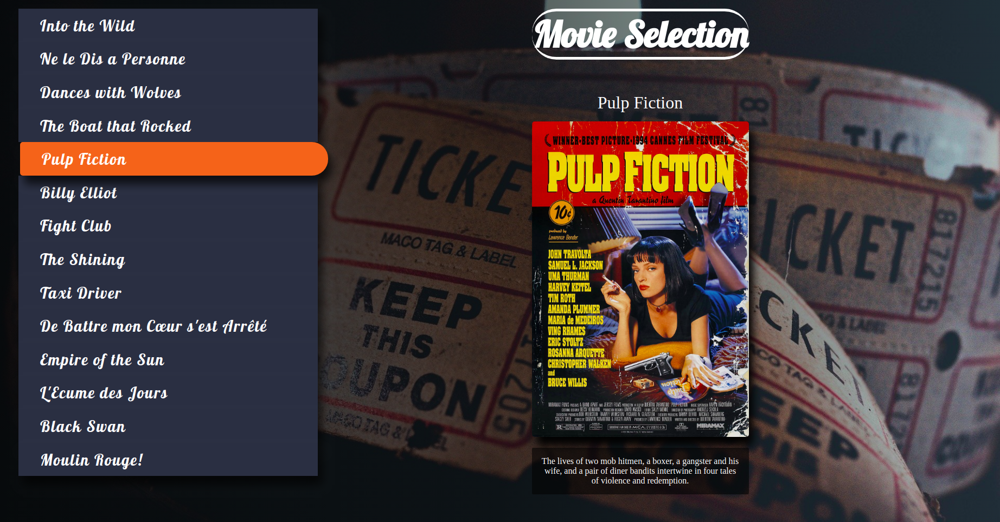
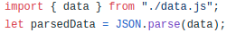
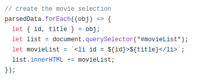
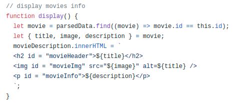

# Movie Selection

- Link of the project: https://kevschmidt.github.io/movie-selection/
- Clone the repository: ``` git clone git@github.com:kevSchmidt/movie-selection.git ```

### Tools:
<h1>


</h1>

### Previews:


  #### import database
  
  
  #### create movie list
  
  
  #### display info
  

### Structure:
```
Project
│   README.md
│   package.json
|   package-lock.json
|
└─── src
      └─── images
      │  
      └─── scripts
      │      └─── data.js
      │      └─── index.js
      │  
      └─── scss
      │     └─── abstracts
      |     |        └─── mixins.scss
      |     |        └─── variables.scss 
      │     |
      |     └─── base
      |     |      └─── base.scss
      |     |
      |     └─── components
      |     |         └─── button.scss
      |     └─── pages
      |     |      └─── homes.scss
      |     |
      |     └───  main.scss
      |
      └─── index.html
```
